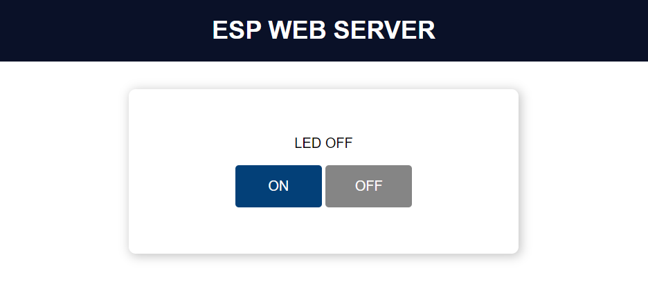

# ESP32 WiFi Manager

In this project, instead of use plenty of wifi-manager libraries, I write my own project for manage wifi.

When first start up, ESP32 will check for `ssid`, `password` and  `hostname` for STA connection. If connection failed, it will switch to `AP` mode which can be used for **configure wifi network**.

You can also use `BOOT button` on ESP32 to manually switch into `AP` mode.

```cpp
pinMode(INT_PIN, INPUT_PULLUP);
attachInterrupt(digitalPinToInterrupt(INT_PIN), intReconfigWiFi, FALLING);
```


The demo application for this project is toggling LED, you can change it for your own application.

```cpp
// Route to set GPIO state to HIGH
server.on("/on", HTTP_GET, [](AsyncWebServerRequest* request) {
    isDisplay = true;
    digitalWrite(LED, isDisplay);
    request->send(SPIFFS, "/index.html", "text/html", false, processor);
});

// Route to set GPIO state to LOW
server.on("/off", HTTP_GET, [](AsyncWebServerRequest* request) {
    isDisplay = false;
    digitalWrite(LED, isDisplay);
    request->send(SPIFFS, "/index.html", "text/html", false, processor);
});
```



I also add `WiFi Auto reconnect` if ESP32 lost connection because of some reasons. This is useful for some other projects.

```cpp
void WiFiStationDisconnected(WiFiEvent_t event, WiFiEventInfo_t info) {
    // Return when configure WiFi
    if (isReconfigWiFi)
        return;
    // Reconnect WiFi
    Serial.print("WiFi lost connection. Reason: ");
    Serial.println(info.disconnected.reason);
    Serial.println("Trying to Reconnect");
    WiFi.begin(ssid.c_str(), password.c_str());
}
```

Happy Hacking!