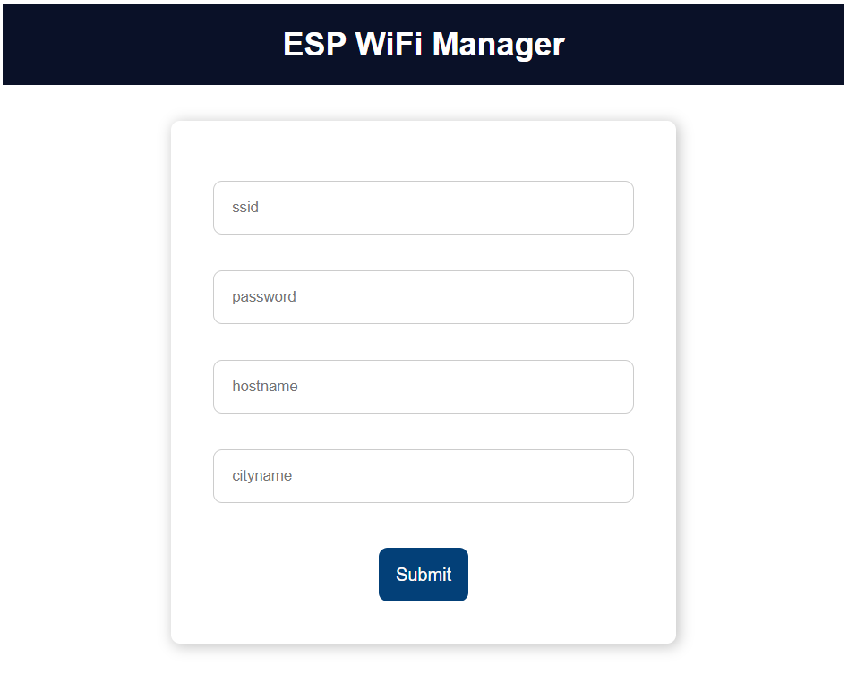

# ESP8266 Weather Station

## 1. Preview

In this project, I build a `Cloud Weather Station` using ESP8266.

This project features:

- WiFi Manager
- WiFi Auto Reconncet
- Minutely Weather Forecast
- Any China City Available
- NTP(Network Time Protocol)

Time information from [NTP API](http://www.ntp.org/), and weather information from [Openweathermap API](https://openweathermap.org/)

## 2. Information and Errors

### 2.1 Start Up

When first start up, ESP8266 will check for `ssid`, `password`,  `hostname` and `city` for WiFi connection.


### 2.2 Start Up Error

If connection failed, it will automatically switch to `AP Mode` for configuration.


You can follow OLED information to connect ESP8266 for configuration. Default AP ssid is `WiFi Manager`, default password is `123456789`. After that go to your browser to `192.168.4.1`, you will see below configuration page.



I add a custom button to manualy switch to AP mode.

```cpp
pinMode(INT_PIN, INPUT_PULLUP);
attachInterrupt(digitalPinToInterrupt(INT_PIN), intReconfigWiFi, FALLING);
```

### 2.3 Start Up Success

However if all goes well, OLED will show connect success information, and then goes into home page. Time and weather information are both from internet, so you must connect WiFi first.


### 2.4 Receive Weather Data Error

When receive weather data from `openweathermap`, it may come into some error, so you may need to check it yourself.


That's all. Happy Hacking!